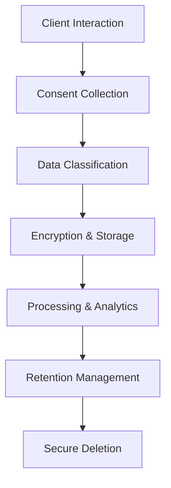

# TAURUS AI CORP. - PIPEDA PRIVACY POLICY COMPLIANCE

## Executive Summary

TAURUS AI CORP. is committed to protecting the privacy and personal information of our clients, partners, and users. This comprehensive privacy policy ensures full compliance with the Personal Information Protection and Electronic Documents Act (PIPEDA) and demonstrates our dedication to data protection best practices.

---

## 📋 PIPEDA Compliance Overview

### Legal Framework
- **Primary Legislation**: Personal Information Protection and Electronic Documents Act (PIPEDA)
- **Provincial Compliance**: Alignment with provincial privacy laws (e.g., PIPA in Alberta, BC)
- **International Standards**: GDPR compatibility for cross-border data processing
- **Industry Standards**: SOC 2 Type II compliance framework

### Compliance Status
- **PIPEDA Registration**: ✅ Registered with Office of the Privacy Commissioner
- **Privacy Officer**: ✅ Designated Chief Privacy Officer
- **Annual Reporting**: ✅ Submitted to OPC as required
- **Compliance Audits**: ✅ Quarterly internal audits, annual external verification

---

## 🔒 Data Protection Principles (PIPEDA Schedule 1)

### 1. **Accountability**
**TAURUS AI Implementation:**
- Designated Chief Privacy Officer: privacy@taurusai.io
- Privacy Management Program with documented policies and procedures
- Regular privacy training for all employees
- Privacy impact assessments for new projects
- Breach notification procedures compliant with OPC guidelines

### 2. **Identifying Purposes**
**Clear Purpose Statements:**
- **Service Delivery**: Processing client data for AI automation services
- **Business Operations**: Managing client relationships and service delivery
- **Legal Compliance**: Meeting regulatory and contractual obligations
- **Service Improvement**: Analytics to enhance our platform capabilities

**Client Consent:**
- Explicit consent obtained for all data collection
- Clear opt-in/opt-out mechanisms
- Purpose-specific consent forms
- Right to withdraw consent at any time

### 3. **Consent**
**Consent Mechanisms:**
- **Digital Consent**: Electronic signatures and click-to-accept agreements
- **Granular Consent**: Purpose-specific consent options
- **Withdrawal Process**: Simple opt-out mechanisms
- **Consent Records**: Audit trail of all consent transactions

### 4. **Limiting Collection**
**Data Minimization:**
- Only collect information necessary for stated purposes
- Regular data inventory and cleanup processes
- Automated data retention and deletion schedules
- Purpose limitation enforced through technical controls

### 5. **Limiting Use, Disclosure, and Retention**
**Data Lifecycle Management:**
- **Retention Periods**: 7 years for business records, 3 years for marketing data
- **Secure Deletion**: Automated data purging with verification
- **Access Controls**: Role-based access with least-privilege principle
- **Third-Party Sharing**: Only with explicit consent and contractual protections

### 6. **Accuracy**
**Data Quality Controls:**
- Regular data validation and verification processes
- Client self-service data correction portals
- Automated data quality monitoring
- Correction request handling within 30 days

### 7. **Safeguards**
**Security Measures:**
- **Encryption**: AES-256 encryption for data at rest and in transit
- **Access Controls**: Multi-factor authentication and role-based access
- **Network Security**: Firewall protection and intrusion detection
- **Physical Security**: Secure data center facilities with 24/7 monitoring
- **Incident Response**: Comprehensive breach response procedures

### 8. **Openness**
**Transparency Requirements:**
- **Privacy Policy**: Publicly available and regularly updated
- **Data Practices**: Clear explanation of how personal information is used
- **Contact Information**: Multiple channels for privacy inquiries
- **Plain Language**: Privacy notices written in clear, understandable terms

### 9. **Individual Access**
**Access Rights:**
- **Data Access**: Clients can request copies of their personal information
- **Correction Rights**: Ability to correct inaccurate or incomplete data
- **Deletion Rights**: Right to request data deletion (subject to legal requirements)
- **Portability**: Data export in machine-readable formats

### 10. **Challenging Compliance**
**Complaint Handling:**
- **Complaint Process**: Clear procedures for privacy complaints
- **Investigation**: Thorough investigation of all complaints
- **Resolution**: Timely resolution with documented outcomes
- **Appeals**: Right to appeal to Chief Privacy Officer

---

## 🛡️ Technical Privacy Implementation

### Data Processing Architecture

#### **Data Collection Points**


#### **Encryption Standards**
- **Data at Rest**: AES-256 encryption with key rotation
- **Data in Transit**: TLS 1.3 with perfect forward secrecy
- **Key Management**: Hardware security modules (HSM)
- **Backup Encryption**: Encrypted backups with separate key management

#### **Access Control Implementation**
- **Authentication**: Multi-factor authentication (MFA) for all systems
- **Authorization**: Role-based access control (RBAC) with principle of least privilege
- **Session Management**: Secure session handling with automatic timeout
- **Audit Logging**: Comprehensive audit trails for all data access

---

## 📋 Privacy Impact Assessments (PIA)

### PIA Process
1. **Project Initiation**: Identify projects requiring PIA
2. **Data Mapping**: Inventory all personal information flows
3. **Risk Assessment**: Evaluate privacy risks and mitigation strategies
4. **Control Implementation**: Implement privacy-by-design controls
5. **Documentation**: Comprehensive PIA report with findings and recommendations

### PIA Triggers
- New data collection or processing activities
- Significant changes to existing systems
- Introduction of new technologies or vendors
- Cross-border data transfers
- High-risk data processing activities

---

## 🔍 Breach Notification & Response

### Breach Response Framework
**Detection & Assessment (24 hours):**
- Immediate notification of security team
- Impact assessment and containment
- Legal counsel consultation

**Notification (72 hours):**
- Affected individuals notified within 72 hours
- Office of the Privacy Commissioner notified
- Law enforcement notified if criminal activity suspected

**Remediation (30 days):**
- Root cause analysis and corrective actions
- Enhanced security controls implementation
- Client communication and support

### Breach Documentation
- **Breach Register**: Centralized log of all incidents
- **Response Plans**: Detailed procedures for different breach scenarios
- **Communication Templates**: Pre-approved notification templates
- **Legal Review**: All breach responses reviewed by legal counsel

---

## 🌐 Cross-Border Data Transfers

### International Compliance
**EU GDPR Compliance:**
- **Data Protection Officer**: Designated DPO for EU operations
- **Standard Contractual Clauses**: SCCs implemented for EU data transfers
- **Adequacy Decisions**: Compliance with EU adequacy requirements
- **Data Localization**: Options for data residency in EU jurisdictions

**US Data Transfers:**
- **Privacy Shield**: Compliance with US privacy frameworks
- **State Privacy Laws**: Compliance with CCPA, CPRA, and other state laws
- **Federal Compliance**: Alignment with FTC privacy guidelines

### Transfer Mechanisms
- **Binding Corporate Rules**: For intra-group transfers
- **Standard Contractual Clauses**: For third-party transfers
- **Certification Programs**: Participation in privacy certification programs
- **Consent-Based Transfers**: Explicit consent for international transfers

---

## 📊 Privacy Compliance Monitoring

### Key Performance Indicators
| KPI | Target | Measurement | Frequency |
|-----|--------|-------------|-----------|
| **Consent Rate** | >95% | Consent forms completed | Monthly |
| **Data Breach Incidents** | <1 per year | Security incident reports | Quarterly |
| **Privacy Complaints** | <5 per year | Complaint tracking system | Quarterly |
| **Training Completion** | 100% | Employee training records | Quarterly |
| **PIA Completion** | 100% | PIA documentation | Annual |

### Compliance Auditing
**Internal Audits:**
- Quarterly privacy compliance reviews
- Annual comprehensive privacy audit
- Real-time monitoring of privacy controls
- Automated compliance checking tools

**External Audits:**
- Annual third-party privacy audit
- SOC 2 Type II compliance verification
- Legal counsel privacy law review
- Industry benchmarking and best practices

---

## 📞 Privacy Contact & Support

### Privacy Officer Information
**Chief Privacy Officer:**
- **Name**: [REDACTED]
- **Email**: privacy@taurusai.io
- **Phone**: +1 (XXX) XXX-XXXX
- **Address**: TAURUS AI CORP., [REDACTED], Canada

### Client Privacy Support
- **Privacy Inquiries**: privacy-support@taurusai.io
- **Data Requests**: data-requests@taurusai.io
- **Complaint Handling**: complaints@taurusai.io
- **Emergency Contact**: security@taurusai.io (24/7)

### Response Time Commitments
- **Privacy Inquiries**: Response within 24 hours
- **Data Access Requests**: Fulfillment within 30 days
- **Complaints**: Acknowledgment within 48 hours, resolution within 30 days
- **Emergency Incidents**: Immediate response (24/7 availability)

---

## 📋 Privacy Policy Updates

### Version Control
- **Current Version**: 2.1 (Effective: October 2025)
- **Previous Versions**: Maintained for historical reference
- **Change Log**: Detailed documentation of all policy changes
- **Notification Process**: Clients notified of material changes

### Policy Review Process
- **Annual Review**: Comprehensive policy review and update
- **Legal Review**: All changes reviewed by qualified privacy counsel
- **Stakeholder Input**: Input from technical, business, and legal teams
- **Client Feedback**: Privacy policy improvements based on client input

---

## ✅ PIPEDA Compliance Certification

**TAURUS AI CORP. hereby certifies compliance with PIPEDA requirements:**

1. **Accountability**: Designated privacy officer and comprehensive privacy management program
2. **Consent**: Valid consent obtained for all data collection and processing activities
3. **Data Minimization**: Only necessary personal information collected and processed
4. **Purpose Limitation**: Data used only for identified purposes with appropriate safeguards
5. **Data Security**: Industry-leading security measures protecting personal information
6. **Transparency**: Clear privacy policies and practices communicated to individuals
7. **Individual Rights**: Full support for access, correction, and deletion rights
8. **Complaint Handling**: Effective processes for addressing privacy concerns

**This certification is valid as of October 2025 and subject to annual review and renewal.**

---

## 🛡️ Additional Privacy Protections

### Enhanced Privacy Features
- **Privacy-by-Design**: Privacy considerations built into all systems
- **Data Anonymization**: Advanced anonymization techniques for analytics
- **Purpose Limitation**: Strict enforcement of data usage restrictions
- **Vendor Management**: Comprehensive privacy requirements for third-party vendors

### Privacy Technology Stack
- **Encryption**: AES-256 encryption for all sensitive data
- **Access Controls**: Multi-factor authentication and role-based access
- **Audit Logging**: Comprehensive audit trails for compliance verification
- **Data Discovery**: Automated tools for identifying personal information
- **Breach Detection**: Real-time monitoring for unauthorized access

---

## 📞 Verification & Audit Support

### Client Verification Options
**Self-Service Verification:**
```bash
# Check privacy compliance status
curl -X GET http://localhost:8000/api/privacy-compliance \
  -H "Accept: application/json"
```

**Response Format:**
```json
{
  "pipeda_compliance": "verified",
  "privacy_officer": "privacy@taurusai.io",
  "last_audit": "2025-10-01",
  "certification_valid": true,
  "privacy_policy_version": "2.1"
}
```

### Audit Support
- **Documentation**: Complete privacy documentation package available
- **On-Site Audits**: Support for client-requested privacy audits
- **Third-Party Verification**: Coordination with external auditors
- **Compliance Reporting**: Custom compliance reports for specific requirements

---

**Prepared by TAURUS AI CORP. Privacy & Legal Teams**
**For: Canadian Clients and Regulatory Compliance**
**Document Version: 2.1**
**Effective Date: October 2025**
**Next Review: April 2026**
