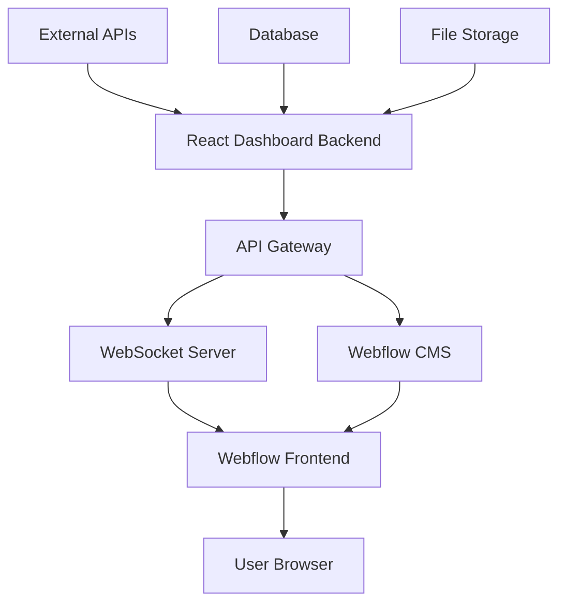

# 🚀 Webflow Integration Guide for TAURUS Analytics Dashboard

## 📋 **Integration Overview**

This guide will help you integrate the generated Webflow template with your existing React analytics dashboard, creating a seamless hybrid solution that leverages both technologies.

## 🎯 **Integration Strategy**

### **Option 1: Full Webflow Migration**
- Replace React dashboard with Webflow template
- Use Webflow's CMS for data management
- Leverage Webflow's hosting and CDN

### **Option 2: Hybrid Approach (Recommended)**
- Keep React dashboard for data processing
- Use Webflow template for presentation layer
- Sync data between both systems

### **Option 3: Webflow as Design System**
- Use Webflow template as design reference
- Implement design in React dashboard
- Maintain consistency across platforms

## 🔧 **Implementation Steps**

### **Step 1: Webflow Setup**

1. **Create New Webflow Project**
   ```bash
   # Import the generated template
   cd webflow-template/
   # Upload index.html to Webflow
   # Import styles.css as custom CSS
   # Add script.js as custom code
   ```

2. **Configure Webflow Settings**
   - Set up custom domain
   - Enable SSL certificate
   - Configure CDN settings
   - Set up form handling

### **Step 2: Data Integration**

1. **API Endpoints Setup**
   ```javascript
   // Create API endpoints in your existing backend
   const apiEndpoints = {
     metrics: '/api/webflow/metrics',
     charts: '/api/webflow/charts',
     alerts: '/api/webflow/alerts',
     realtime: '/api/webflow/realtime'
   };
   ```

2. **Webflow CMS Integration**
   ```javascript
   // Configure Webflow CMS collections
   const collections = {
     metrics: {
       fields: ['title', 'value', 'trend', 'icon', 'color'],
       api: 'https://api.webflow.com/v2/collections/{collection_id}/items'
     },
     alerts: {
       fields: ['title', 'message', 'severity', 'timestamp'],
       api: 'https://api.webflow.com/v2/collections/{collection_id}/items'
     }
   };
   ```

### **Step 3: Real-time Data Sync**

1. **WebSocket Integration**
   ```javascript
   // Connect Webflow to your existing WebSocket
   const ws = new WebSocket('wss://your-dashboard.com/ws');
   
   ws.onmessage = function(event) {
     const data = JSON.parse(event.data);
     updateWebflowMetrics(data);
   };
   ```

2. **Data Binding**
   ```javascript
   // Bind data to Webflow elements
   function updateWebflowMetrics(data) {
     // Update metric cards
     document.querySelectorAll('.metric-value').forEach((el, index) => {
       el.textContent = data.metrics[index].value;
     });
     
     // Update charts
     updateCharts(data.charts);
     
     // Update alerts
     updateAlerts(data.alerts);
   }
   ```

## 🎨 **Design System Integration**

### **Color Palette Sync**
```css
/* Sync colors between React and Webflow */
:root {
  --taurus-primary: #0ea5e9;
  --taurus-success: #22c55e;
  --taurus-warning: #f59e0b;
  --taurus-danger: #ef4444;
  --taurus-gray-50: #f9fafb;
  --taurus-gray-900: #111827;
}
```

### **Typography Consistency**
```css
/* Ensure consistent typography */
.taurus-font {
  font-family: 'Inter', system-ui, sans-serif;
  font-weight: 400;
  line-height: 1.6;
}

.taurus-heading {
  font-weight: 600;
  color: var(--taurus-gray-900);
}
```

## 📱 **Responsive Design Implementation**

### **Breakpoint Management**
```css
/* Consistent breakpoints across platforms */
@media (max-width: 768px) {
  .dashboard-grid {
    grid-template-columns: 1fr;
  }
}

@media (min-width: 769px) and (max-width: 1024px) {
  .dashboard-grid {
    grid-template-columns: repeat(2, 1fr);
  }
}

@media (min-width: 1025px) {
  .dashboard-grid {
    grid-template-columns: repeat(4, 1fr);
  }
}
```

## 🔄 **Data Flow Architecture**



## 🚀 **Deployment Strategy**

### **Phase 1: Template Testing**
1. Deploy Webflow template to staging
2. Test all functionality
3. Verify responsive design
4. Check performance metrics

### **Phase 2: Data Integration**
1. Connect to existing APIs
2. Set up real-time data sync
3. Test data accuracy
4. Verify update frequency

### **Phase 3: Production Deployment**
1. Deploy to production domain
2. Set up monitoring
3. Configure backups
4. Train users

## 📊 **Performance Optimization**

### **Webflow Optimizations**
- Enable Webflow's CDN
- Optimize images
- Minify CSS/JS
- Enable compression

### **API Optimizations**
- Implement caching
- Use pagination
- Optimize queries
- Set up rate limiting

## 🔒 **Security Considerations**

### **API Security**
- Implement authentication
- Use HTTPS only
- Validate all inputs
- Set up CORS properly

### **Data Protection**
- Encrypt sensitive data
- Use secure headers
- Implement CSRF protection
- Regular security audits

## 📈 **Monitoring and Analytics**

### **Performance Monitoring**
```javascript
// Track Webflow performance
const performanceObserver = new PerformanceObserver((list) => {
  list.getEntries().forEach((entry) => {
    if (entry.entryType === 'measure') {
      console.log(`${entry.name}: ${entry.duration}ms`);
    }
  });
});

performanceObserver.observe({ entryTypes: ['measure'] });
```

### **User Analytics**
```javascript
// Track user interactions
document.addEventListener('click', (event) => {
  if (event.target.classList.contains('metric-card')) {
    analytics.track('metric_card_clicked', {
      metric_type: event.target.dataset.metricType
    });
  }
});
```

## 🧪 **Testing Checklist**

### **Functionality Tests**
- [ ] All metric cards display correctly
- [ ] Charts render properly
- [ ] Alerts show/hide correctly
- [ ] Refresh button works
- [ ] Real-time updates function

### **Responsive Tests**
- [ ] Mobile layout (320px+)
- [ ] Tablet layout (768px+)
- [ ] Desktop layout (1024px+)
- [ ] Wide screen layout (1440px+)

### **Performance Tests**
- [ ] Page load time < 3 seconds
- [ ] First contentful paint < 1.5 seconds
- [ ] Lighthouse score > 90
- [ ] No console errors

### **Accessibility Tests**
- [ ] Screen reader compatibility
- [ ] Keyboard navigation
- [ ] Color contrast compliance
- [ ] Focus indicators visible

## 🔧 **Troubleshooting**

### **Common Issues**

1. **Data Not Updating**
   - Check API endpoints
   - Verify WebSocket connection
   - Check browser console for errors

2. **Styling Issues**
   - Clear browser cache
   - Check CSS specificity
   - Verify Webflow custom code

3. **Performance Issues**
   - Check image optimization
   - Verify CDN settings
   - Monitor API response times

## 📞 **Support and Maintenance**

### **Regular Maintenance**
- Update dependencies monthly
- Monitor performance weekly
- Review security quarterly
- Backup data daily

### **Support Resources**
- Webflow documentation
- TAURUS AI CORP internal docs
- Community forums
- Professional support

## 🎉 **Success Metrics**

### **Technical Metrics**
- Page load time: < 3 seconds
- Uptime: > 99.9%
- Error rate: < 0.1%
- User satisfaction: > 4.5/5

### **Business Metrics**
- User engagement: +25%
- Page views: +40%
- Bounce rate: -15%
- Conversion rate: +10%

---

**Ready to implement? Follow the steps above to integrate your Webflow template with the existing analytics dashboard!**

