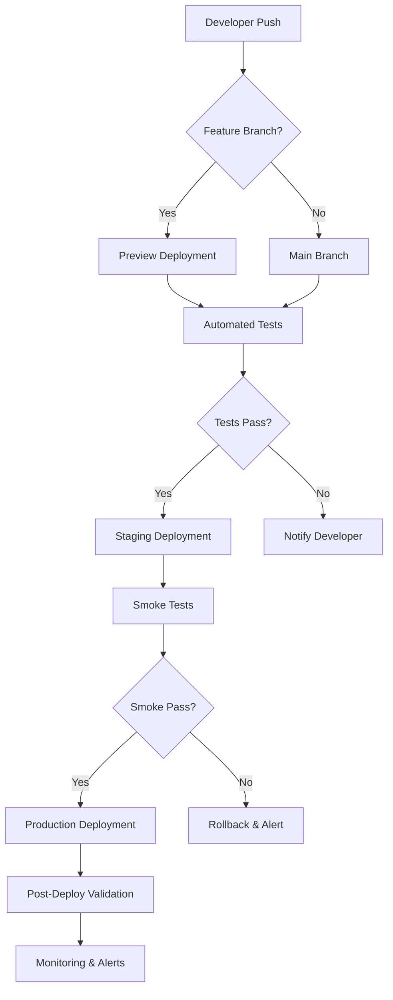

# Mater Maria Homes Technical Architecture

## System Overview
The Mater Maria Homes investor portal is a full-stack web application built with Next.js 14, React 19, TypeScript, and Tailwind CSS. The application serves as an AI-powered investment platform for NRI investors interested in luxury wellness villas in Kerala, India.

## Architecture Diagram
```
Frontend (Next.js)  <--->  API Layer  <--->  Supabase Backend
     |                         |                   |
     V                         V                   V
React Components    Server Actions    Auth    Database    Storage    AI Services
     |                         |                   |
     V                         V                   V
UI Components    API Routes    User Mgmt    Tables    Files    Gemini API
```

## Technology Stack Details

### Frontend
- **Framework**: Next.js 14 (App Router)
- **Language**: TypeScript 5.x
- **Styling**: Tailwind CSS 4.x
- **UI Components**: Custom built with Radix UI primitives
- **State Management**: React Context API + SWR for data fetching
- **Animations**: Framer Motion + GSAP
- **Internationalization**: Next-i18next (for EN/ML language support)
- **Forms**: React Hook Form with Zod validation
- **Charts**: Recharts + Chart.js for ROI visualizations

### Backend & Infrastructure
- **Database**: Supabase PostgreSQL (managed)
- **Authentication**: Supabase Auth (email/social login)
- **Storage**: Supabase Storage (for property images/videos)
- **API Layer**: Next.js API Routes + Server Actions
- **Real-time**: Supabase Realtime (for chat updates)
- **Edge Functions**: Supabase Functions (for webhooks)

### Third-Party Integrations
- **Payments**: Razorpay Gateway (INR/USD processing)
- **Analytics**: 
  - PostHog (product analytics, session recording)
  - Google Analytics 4 (traffic & conversion tracking)
  - Google Search Console (SEO monitoring)
- **AI/Chatbot**: Google Gemini Pro API (investor queries, property recommendations)
- **Communication**: 
  - Twilio WhatsApp API (investor notifications)
  - SendGrid (email notifications)
  - Zoom API (virtual property tours)
- **Maps**: Google Maps API (property locations, area highlights)
- **Calendar**: Google Calendar API (site visit scheduling)

### DevOps & Deployment
- **Platform**: Vercel (frontend hosting)
- **CI/CD**: GitHub Actions (testing, linting, preview deployments)
- **DNS**: Cloudflare (domain management, SSL, CDN)
- **Monitoring**: 
  - Vercel Analytics (performance, errors)
  - Sentry (error tracking)
  - Logtail (log aggregation)
- **Backup**: Supabase automated backups + manual exports
- **SSL**: Automatic via Vercel + Cloudflare (Let's Encrypt)

## Core Features Architecture

### 1. Investor Portal (Public)
- **Landing Page**: SEO-optimized, conversion-focused
- **Property Showcase**: Gallery, 3D tours, video walkthroughs
- **Investment Tiers**: Different villa types with pricing
- **ROI Calculator**: Interactive tool with assumptions toggle
- **Smart Estate Showcase**: Amenities, facilities, technology
- **Trust & Credibility**: Testimonials, certifications, partner logos
- **Lead Capture**: Multi-step form with WhatsApp/email follow-up

### 2. Investor Dashboard (Authenticated)
- **Portfolio Overview**: Holdings, current value, projected returns
- **Document Library**: Contracts, payment receipts, ownership docs
- **Communication Hub**: Chat with sales/support, WhatsApp integration
- **Payment Portal**: Secure payment processing, installment tracking
- **Property Manager**: Unit selection, customization options, upgrade tracking
- **Reports & Statements**: Tax documents, performance reports, ROI statements

### 3. Admin Portal (Internal)
- **Lead Management**: Tracking, scoring, assignment, follow-up automation
- **Property Management**: Unit inventory, availability, pricing controls
- **Content Management**: CMS for pages, blogs, galleries, testimonials
- **Analytics Dashboard**: Conversion funnels, CAC, LTV, cohort analysis
- **Financial Management**: Revenue tracking, payouts, reconciliation
- **Support Ticket System**: Issue tracking, SLA management, knowledge base

## Data Models

### User Profile
```typescript
{
  id: string;           // Supabase UUID
  email: string;
  full_name: string;
  phone: string;        // With country code
  country: string;      // For NRI classification
  investor_type: 'individual' | 'corporate' | 'nri';
  kyc_status: 'pending' | 'verified' | 'rejected';
  created_at: timestamp;
  updated_at: timestamp;
}
```

### Property/Villa
```typescript
{
  id: string;
  villa_number: string;
  type: '2BHK' | '3BHK' | '4BHK' | '5BHK';
  size_sqft: number;
  price_inr: number;
  price_usd: number;
  status: 'available' | 'booked' | 'under_construction' | 'ready_for_possession';
  features: string[];   // Smart home, sustainability, etc.
  images: string[];     // Supabase storage URLs
  floor_plan: string;   // PDF URL
  vastu_compliant: boolean;
}
```

### Investment/Booking
```typescript
{
  id: string;
  user_id: string;      // FK to users
  villa_id: string;     // FK to properties
  booking_date: timestamp;
  amount_inr: number;
  amount_usd: number;
  payment_plan: '40-30-30' | '50-50' | '100';
  installments: Array<{
    due_date: timestamp;
    amount: number;
    paid: boolean;
    paid_date?: timestamp;
    payment_id?: string; // Razorpay payment ID
  }>;
  status: 'pending' | 'confirmed' | 'active' | 'completed' | 'cancelled';
  agreement_url?: string;
}
```

### ROI Calculation (Cached)
```typescript
{
  id: string;
  villa_id: string;
  user_id: string;
  calculation_date: timestamp;
  assumptions: {
    appreciation_rate: number; // % per year
    rental_yield: number;      // % per year
    holding_period: number;    // years
    inflation_rate: number;    // %
    exchange_rate: number;     // USD/INR (if applicable)
  };
  results: {
    total_investment: number;
    estimated_resale_value: number;
    total_rental_income: number;
    net_profit: number;
    roi_percentage: number;
    irr: number; // Internal Rate of Return
  };
}
```

### Chat Conversation (Gemini-powered)
```typescript
{
  id: string;
  user_id: string;
  session_id: string;   // Groups related messages
  message: string;
  response: string;
  timestamp: timestamp;
  context: Record<string, any>; // Property IDs, user preferences, etc.
  sentiment: 'positive' | 'neutral' | 'negative';
  escalated: boolean;   // Flagged for human agent review
}
```

## Security Architecture

### Authentication & Authorization
- **User Auth**: Supabase Auth (email/password, Google, Apple)
- **Session Management**: JWT tokens with refresh rotation
- **Role-Based Access Control (RBAC)**:
  - Public: Unauthenticated users (limited access)
  - Investor: Authenticated users (portfolio access)
  - Admin: Staff users (full CRM access)
  - Superadmin: System administrators
- **API Protection**: Rate limiting, input validation, SQL injection prevention
- **Data Encryption**: TLS 1.3 in transit, AES-256 at rest (Supabase managed)

### Payment Security
- **PCI DSS Compliance**: Razorpay handles card data (we never store PAN)
- **Tokenization**: Payment method tokens for recurring payments
- **Webhook Verification**: Signature validation for all payment callbacks
- **Fraud Detection**: Razorpay fraud tools + custom velocity checks

### Application Security
- **Headers**: Helmet.js equivalent via Next.js security headers
- **CORS**: Restricted to trusted domains
- **Input Validation**: Zod schemas on all API endpoints
- **Output Encoding**: Automatic XSS prevention in React
- **CSRF Protection**: SameSite cookies + anti-CSRF tokens for forms
- **Dependency Scanning**: npm audit + Dependabot alerts
- **Secrets Management**: Environment variables via Vercel + .env.local (gitignored)

## Performance Optimization

### Frontend Optimization
- **Code Splitting**: Automatic route-based splitting (Next.js)
- **Lazy Loading**: Images, components, third-party scripts
- **Image Optimization**: Next.js Image component (automatic WebP, sizes)
- **Font Optimization**: Self-hosted fonts with font-display: swap
- **CSS Optimization**: Tailwind JIT + purgeCSS
- **JavaScript Minification**: ESBuild + Terser
- **Critical CSS**: Inline above-the-fold styles
- **Prefetching**: Link prefetching for predicted navigation

### Backend Optimization
- **Database**: 
  - Proper indexing on foreign keys, search fields
  - Connection pooling (Supabase managed)
  - Read replicas for analytics queries
  - Partitioning for large tables (if needed)
- **Caching**:
  - SWR stale-while-revalidate for client-side
  - Vercel Edge Cache for API routes (where appropriate)
  - Supabase Edge Functions caching
  - Redis-like caching via Upstash (for expensive computations)
- **API Optimization**:
  - Pagination for large datasets
  - Field selection (GraphQL-like via select queries)
  - Batch requests where applicable
  - WebSocket efficiency for real-time features

### Infrastructure Optimization
- **CDN**: Vercel Edge Network + Cloudflare
- **Regional Deployment**: Closest to user locations (major NRI markets)
- **Database Region**: Supabase region selected for latency optimization
- **Asset Optimization**: Image compression, video transcoding adaptive bitrate
- **Third-Party Loading**: Async loading of non-critical scripts

## Monitoring & Observability

### Metrics Collection
- **Performance**: Core Web Vitals (LCP, FID, CLS)
- **Usage**: Page views, feature adoption, funnel conversion
- **Business**: Lead-to-customer ratio, average deal size, sales velocity
- **Technical**: API latency, error rates, database query performance
- **Infrastructure**: Serverless function duration, memory usage, cold starts

### Logging Strategy
- **Application**: Structured JSON logs with correlation IDs
- **Access**: HTTP request/response logging (sanitized)
- **Security**: Authentication attempts, permission denials
- **Audit**: Data access trails for sensitive operations (GDPR compliance)
- **Errors**: Full stack traces with context (in development only)

### Alerting Thresholds
- **Performance**: Page load > 3s, API response > 2s
- **Error Rate**: > 1% of requests, > 5% of user actions
- **Availability**: Uptime < 99.9% (5 min window)
- **Business**: Lead conversion drop > 20% week-over-week
- **Security**: Multiple failed logins, suspicious payment patterns

## Scalability Considerations

### Horizontal Scaling
- **Stateless Frontend**: Next.js on Vercel automatically scales
- **Database**: Supabase scales vertically with plan upgrades
- **Storage**: Supabase Storage scales with usage
- **Third-Party Services**: Most have built-in scaling (Razorpay, Gemini, etc.)

### Vertical Scaling Options
- **Database**: Upgrade Supabase plan for more compute/storage
- **Caching**: Implement Redis layer for complex computations
- **Search**: Integrate Algolia/ElasticSearch for property search
- **Analytics**: Data warehouse (BigQuery/Snowflake) for deep analytics

### Bottleneck Prevention
- **Asset Delivery**: CDN caching with proper cache-control headers
- **API Rate Limiting**: Per-user and per-IP limits on expensive endpoints
- **Database Connection Limits**: Pool sizing and query optimization
- **Third-Party Limits**: Monitor and respect API rate limits of integrations
- **Queue Processing**: Offload emails, reports, webhooks to background jobs

## Development Workflow

### Local Development
```bash
# Environment setup
cp .env.example .env.local
# Edit .env.local with local Supabase credentials

# Install dependencies
npm install

# Start development server
npm run dev
# Available at http://localhost:3000

# Run tests
npm test

# Lint and format
npm run lint
npm run format
```

### Testing Strategy
- **Unit Tests**: Jest + React Testing Library (components, hooks, utils)
- **Integration Tests**: Cypress (critical user flows)
- **E2E Tests**: Playwright (full application scenarios)
- **API Tests**: Supertest (endpoint validation)
- **Visual Regression**: Percy or Chromatic (UI consistency)
- **Accessibility**: axe-core (WCAG compliance)
- **Performance**: Lighthouse CI (performance budgets)

### Deployment Pipeline


### Release Management
- **Branch Strategy**: 
  - `main`: Production-ready
  - `staging`: Pre-production validation
  - `feature/*`: New features
  - `bugfix/*`: Production fixes
  - `release/*`: Release candidates
- **Versioning**: Semantic Versioning (MAJOR.MINOR.PATCH)
- **Changelog**: Automated from conventional commits
- **Rollback**: Vercel instant rollbacks + database point-in-time recovery

## Compliance & Legal

### Data Protection
- **GDPR**: Data processing agreements, right to be forgotten, data portability
- **Indian IT Act**: Data localization considerations for sensitive data
- **PCI DSS**: Through Razorpay compliance (SAQ-D)
- **SEC/FINRA**: Investment disclosure requirements (where applicable)

### Accessibility
- **WCAG 2.1 AA**: Target compliance level
- **Screen Reader Support**: ARIA labels, logical tab order
- **Color Contrast**: Minimum 4.5:1 for text, 3:1 for large text
- **Keyboard Navigation**: Full functionality without mouse
- **Responsive Design**: Mobile-first approach

### Content & Marketing
- **RERA Compliance**: Real estate advertising regulations (India)
- **Investment Disclaimers**: Risk factors, past performance disclaimers
- **Testimonial Verification**: Authentic customer experiences with permissions
- **Copyright**: Proper licensing for images, fonts, third-party assets

## Future Enhancements

### Phase 2 Features
- **Virtual Reality Tours**: WebXR integration for immersive property viewing
- **Blockchain Integration**: Smart contracts for automated agreements, NFT-based ownership certificates
- **Advanced AI**: Predictive investment advice, market trend analysis
- **IoT Integration**: Smart home device control portal for residents
- **Community Portal**: Resident forums, event booking, facility reservations
- **Multi-language Support**: Arabic, Mandarin for broader NRI reach

### Technical Improvements
- **Micro Frontends**: Module Federation for team-independent deployments
- **GraphQL**: Replace REST APIs for more efficient data fetching
- **Server Components**: Increase Server Components ratio for better performance
- **Edge Computing**: More logic on Vercel Edge Functions for lower latency
- **Data Lakehouse**: Integrate with Snowflake/Databricks for analytics scaling

## Dependencies & Licensing

### Critical Dependencies
- **Next.js**: MIT License
- **React**: MIT License
- **TypeScript**: Apache License 2.0
- **Tailwind CSS**: MIT License
- **Supabase**: Apache License 2.0 (client), various (server)
- **Zod**: MIT License
- **React Hook Form**: MIT License
- **Framer Motion**: MIT License
- **GSAP**: Standard License (commercial use covered)
- **Recharts**: MIT License
- **PostHog**: MIT License
- **Gemini API**: Proprietary (Google Cloud Terms)

### Licensing Compliance
- All dependencies reviewed for compatibility
- No GPL/Agpl dependencies that would require source disclosure
- Commercial licenses obtained where required (GSAP, certain fonts/images)
- Internal code: Proprietary (Mater Maria Homes)
- Documentation: CC BY-NC-SA 4.0 (Creative Commons)

---
*Document Version: 1.0*
*Last Updated: $(date)*
*Next Review: $(date -d '+3 months')*